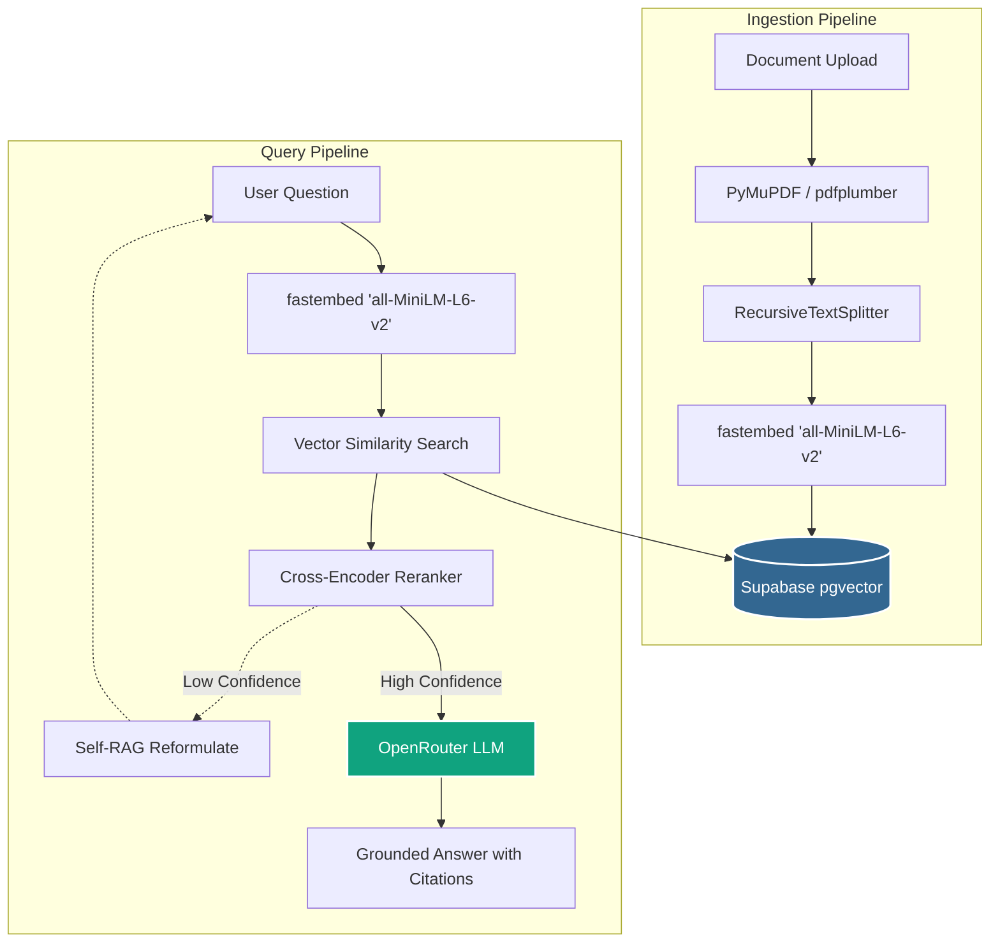

# 🧠 DocuMind — Full-Stack Enterprise RAG System

> A production-ready Retrieval-Augmented Generation (RAG) application with JWT authentication, per-user document isolation, multi-turn conversational memory, and a confidence-gated self-correcting retrieval loop.

**Live Demo (Frontend):** [https://documind-rag-six.vercel.app](https://documind-rag-six.vercel.app)
**Live API (Backend):** Hosted on Render

[](https://www.python.org/downloads/)
[](https://fastapi.tiangolo.com)
[](https://github.com/pgvector/pgvector)
[](https://react.dev)

---

## ✨ Key Features & Architecture

- **Full-Stack Deployment** — React frontend hosted on Vercel, Python FastAPI backend hosted on Render.
- **Advanced Memory Management** — Architected to process massively large documents (1000+ pages) on a strict 512MB RAM budget. Uses extreme memory control techniques including batched embedding streaming and explicit Python Garbage Collection (`gc.collect()`) to prevent OOM server crashes.
- **Vector Database (Supabase)** — Uses PostgreSQL + `pgvector` for storing and retrieving high-dimensional vectors, ensuring relational and vector data are kept perfectly in sync.
- **Local Embeddings & Reranking** — Runs `fastembed` (`all-MiniLM-L6-v2`) entirely locally to generate vector embeddings for free. Uses a **Cross-Encoder Reranker** to deeply score mathematical relationships between the query and the chunk before injecting them into the prompt.
- **LLM Orchestration (OpenRouter)** — Dynamically routes to dozens of open-source and proprietary models (`gpt-4o`, `llama-3`, etc.) using the OpenAI-compatible LangChain wrapper.
- **Multi-Turn Chat Memory** — Redis-backed conversation history (Upstash), dual-written to PostgreSQL for a durable message log.
- **Authentication & Security** — JWT-based signup/login with bcrypt password hashing. All queries and document storage are isolated per user.
- **Agentic Self-RAG** — Built with LangGraph. Scores retrieval confidence; if confidence is low, the query is automatically reformulated and retried, dramatically reducing LLM hallucinations.

---

## 🏗️ Architecture



**Data model (PostgreSQL, 6 tables):** `User`, `Document`, `Embedding`, `ChatSession`, `Message`, `QueryLog` — managed via SQLAlchemy + Alembic migrations.

---

## 🚀 Quick Start

### 1. Backend setup

```bash
git clone https://github.com/Komal036/documind-rag.git
cd documind-rag

python -m venv venv
venv\Scripts\activate        # Windows
# source venv/bin/activate   # Mac/Linux

pip install -r requirements.txt
```

### 2. Configure

```bash
cp .env.example .env
# Fill in: DATABASE_URL, JWT_SECRET_KEY, REDIS_HOST, GROQ_API_KEY (or your chosen LLM provider key)
```

### 3. Database

Requires PostgreSQL with the `pgvector` extension enabled, and a Redis-compatible instance for chat memory (Upstash Redis in production; local Redis or Memurai for local dev).

```bash
alembic upgrade head
```

### 4. Run the backend

```bash
uvicorn src.main:app --host 0.0.0.0 --port 8000 --reload
```

API docs: **http://localhost:8000/docs**

### 5. Run the frontend

```bash
cd frontend/react_app
npm install
npm run dev
```

UI: **http://localhost:5173**

---

## 📡 API Endpoints

| Method   | Endpoint                       | Auth required | Description                                             |
| -------- | ------------------------------- | :-----------: | -------------------------------------------------------- |
| `GET`    | `/health`                       | No             | Liveness probe                                           |
| `POST`   | `/api/v1/auth/signup`           | No             | Create account, returns JWT                              |
| `POST`   | `/api/v1/auth/login`            | No             | Authenticate, returns JWT                                |
| `GET`    | `/api/v1/auth/me`               | Yes            | Current user info                                         |
| `POST`   | `/api/v1/ingest`                | Yes            | Upload & index a document                                |
| `POST`   | `/api/v1/query`                 | Yes            | Ask a question (supports `use_self_rag`, `session_id`)    |
| `GET`    | `/api/v1/stats`                 | Yes            | Index statistics for the current user                     |
| `DELETE` | `/api/v1/documents/{filename}`  | Yes            | Remove a document                                          |
| `POST`   | `/api/v1/chat/sessions`         | Yes            | Create a chat session for multi-turn memory               |

### Example

```bash
# Sign up
curl -X POST http://localhost:8000/api/v1/auth/signup \
  -H "Content-Type: application/json" \
  -d '{"email": "you@example.com", "password": "yourpassword", "full_name": "Your Name"}'

# Ingest (replace TOKEN with the access_token from signup/login)
curl -X POST http://localhost:8000/api/v1/ingest \
  -H "Authorization: Bearer TOKEN" \
  -F "file=@data/samples/sample_hr_policy.txt"

# Query
curl -X POST http://localhost:8000/api/v1/query \
  -H "Authorization: Bearer TOKEN" \
  -H "Content-Type: application/json" \
  -d '{"question": "What is the remote work policy?"}'

# Query with Self-RAG (confidence-gated retrieval loop)
curl -X POST http://localhost:8000/api/v1/query \
  -H "Authorization: Bearer TOKEN" \
  -H "Content-Type: application/json" \
  -d '{"question": "What is the remote work policy?", "use_self_rag": true}'
```

---

## 📊 Evaluation

A RAGAS evaluation baseline was run against an 8-question set grounded in the sample HR policy document (`scripts/evaluate_ragas.py`, `data/eval/hr_policy_qa.json`), using `openai/gpt-oss-120b` as the generation model.

**v1 (single-pass retrieval) vs. Self-RAG (v2), same question set, same judge model:**

| Metric                    | v1    | Self-RAG (v2) | Change                                                       |
| -------------------------- | ----- | -------------- | -------------------------------------------------------------- |
| Faithfulness               | 0.750 | 0.875          | +0.125                                                          |
| Answer Relevancy           | 0.833 | 0.834          | ~flat                                                           |
| Avg. retries per question  | —     | 0.50           | Half of questions triggered at least one query reformulation   |

Both scores exclude one deliberately out-of-scope question (asking about a policy not present in the documents), since a correct refusal cannot be meaningfully scored by the AnswerRelevancy metric.

**Notes on methodology, stated plainly rather than glossed over:**

- Faithfulness shows a clear, meaningful gain under Self-RAG on this set — the confidence-gated retry loop measurably reduces unsupported claims by allowing a second retrieval attempt when the first pass returns weak context.
- Answer relevancy stayed essentially flat, suggesting Self-RAG's main benefit here is grounding quality rather than topical relevance — which matches the design intent (it's a faithfulness/confidence mechanism, not a relevance-tuning one).
- LLM-judge metrics have real run-to-run and judge-model-to-judge-model variance. This comparison controlled for that by using the identical judge model for both runs.
- This baseline was re-run after migrating the generation model from `llama-3.3-70b-versatile` to `openai/gpt-oss-120b` (Groq deprecated the former on 2026-08-16). Earlier exploratory runs on the previous model produced different absolute numbers, which is expected — the relative Self-RAG-vs-v1 comparison is the meaningful signal, not the absolute scores in isolation.

This baseline was also used to diagnose and fix a real issue: the system was occasionally including related-but-unasked-for information from the same retrieved chunk, which was addressed with a targeted system prompt constraint.

---

## ⚙️ Key Configuration (`.env`)

| Variable                          | Description                                                       |
| ---------------------------------- | ------------------------------------------------------------------- |
| `DATABASE_URL`                     | PostgreSQL connection string (with pgvector)                        |
| `JWT_SECRET_KEY`                   | Secret for signing JWTs                                             |
| `REDIS_HOST` / `REDIS_PORT`        | Redis connection for chat memory                                    |
| `GROQ_API_KEY`                     | LLM provider key (OpenAI/Mistral also supported)                    |
| `VECTOR_STORE_TYPE`                | `pgvector` (production) or `chroma` (local dev)                     |
| `SELF_RAG_MAX_RETRIES`             | Retry budget for the Self-RAG loop (default: 2)                     |
| `SELF_RAG_CONFIDENCE_THRESHOLD`    | Reranker score threshold for "confident enough" (default: 1.0)      |

See `.env.example` for the full list.

---

## 🗂 Project Structure

```
src/
├── auth/          # JWT auth: password hashing, token creation/verification
├── db/            # SQLAlchemy models, connection, Alembic-managed schema
├── ingestion/      # Document loading (PDF, DOCX, TXT, MD)
├── chunking/      # Text splitting
├── embeddings/     # sentence-transformers embedding generation
├── retrieval/     # Vector store (pgvector/Chroma) + retriever
├── reranking/     # Cross-encoder re-ranking
├── generation/     # LLM answer generation with citations
├── memory/        # Redis-backed multi-turn chat memory
├── agentic/       # Self-RAG (Corrective RAG) LangGraph implementation
├── api/           # FastAPI routes + Pydantic schemas
├── utils/         # Config, logging, exceptions
├── pipeline.py    # RAG orchestrator
└── main.py        # FastAPI app entry point

frontend/
└── react_app/     # React + Vite + Tailwind frontend

scripts/
└── evaluate_ragas.py   # RAGAS evaluation script

alembic/           # Database migrations
data/eval/         # Evaluation question sets and results
```

---

## 🧪 Tests

```bash
pip install -r requirements-dev.txt
pytest tests/ -v
```

---

_Built with FastAPI · PostgreSQL/pgvector · Redis · LangChain · LangGraph · React · RAGAS_
